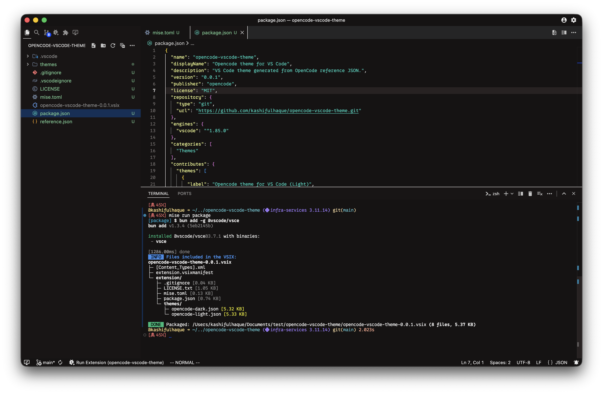

# Opencode theme for VS Code

A VS Code theme generated from OpenCode reference JSON.

## Screenshot

## Install

- Run `code --install-extension opencode-vscode-theme-0.0.1.vsix`
- Or use Extensions → “Install from VSIX…”

## Development

- Run Extension (F5) to launch the Extension Development Host.
- Pick the theme from Command Palette → “Preferences: Color Theme”.
